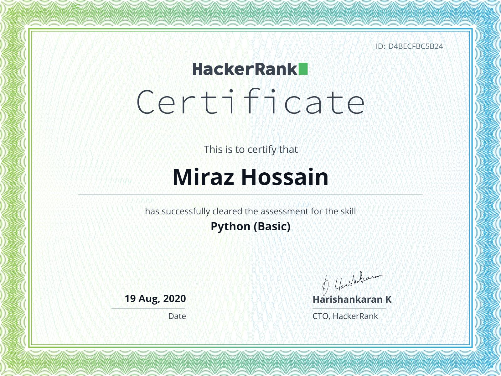
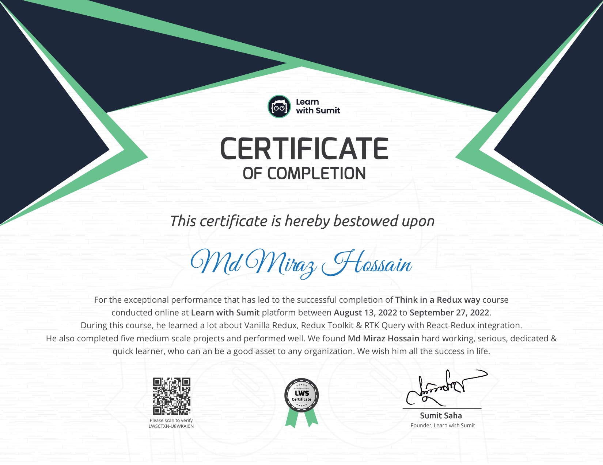
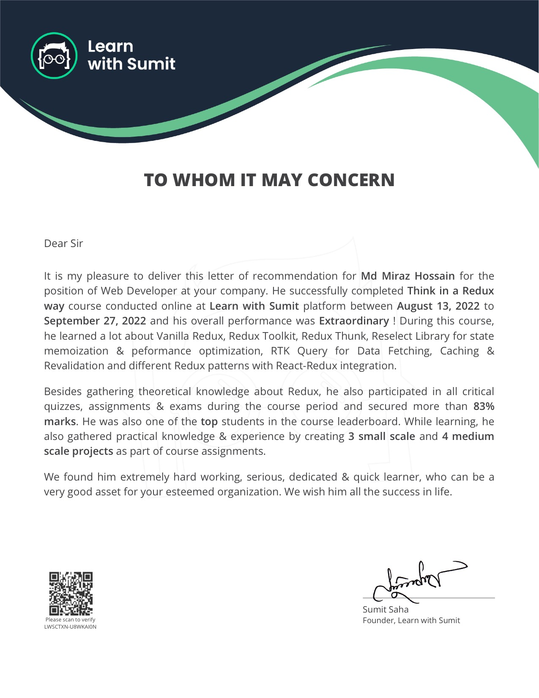
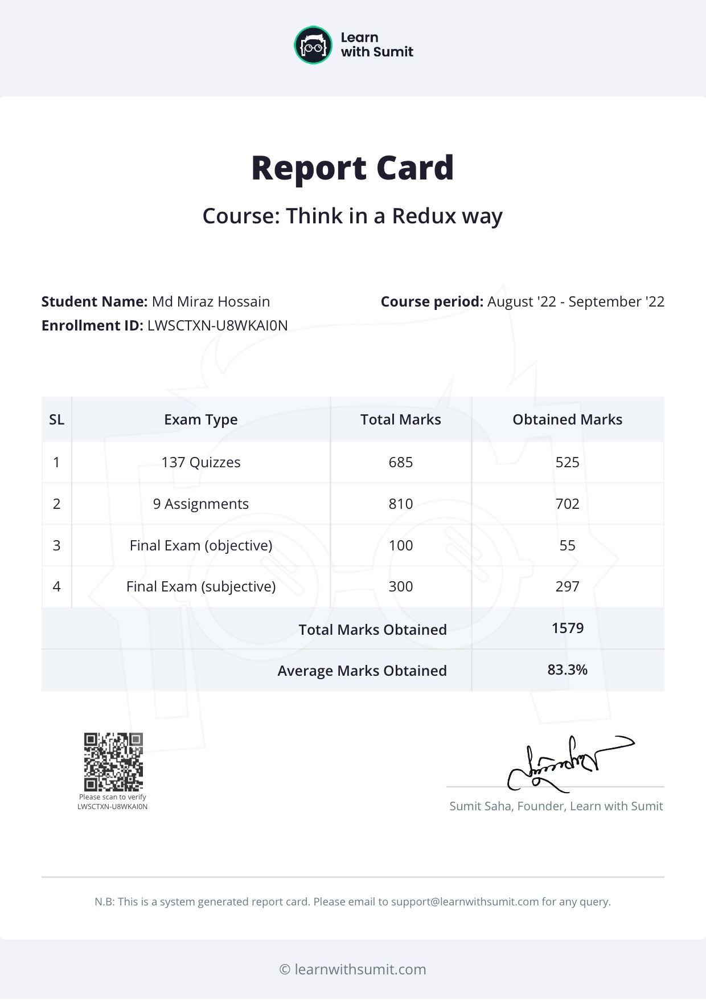

<h1 align="center">
    Hello there, I'm Miraz  
</h1>

I'm using HTML, CSS, and JavaScript to make websites dance. 🕺🏽

**I love working with**

  
  
  

### 🔭 I’m working on

-   Share My knowledge with make content.
-   Growing [chapterclose](https://chapterclose.com) to 2k/month visitors.

<h4 align="center">
  
     If you're here please give me stars ⭐ And don't forget to follow
    
</h4>

### 🌱 I’m learning

  
  
  

### Connect with me:

<!-- 

 -->
### 📫 How to reach me

  
  
  
  
  

### My languages:

    
    

 

##### [verify](https://www.hackerrank.com/certificates/d4becfbc5b24)

 

#### Verify LWS Certificate: [verify](https://learnwithsumit.com/certificates/verify/LWSCTXN-U8WKAI0N)

  

<!-- Show Flower stars and Visitor Badge -->

