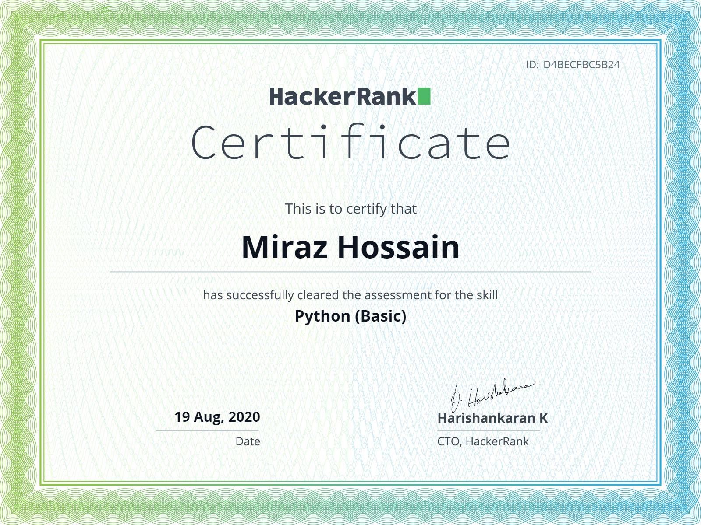
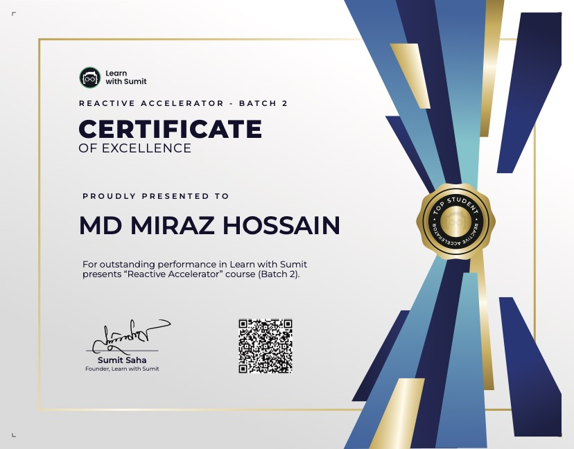
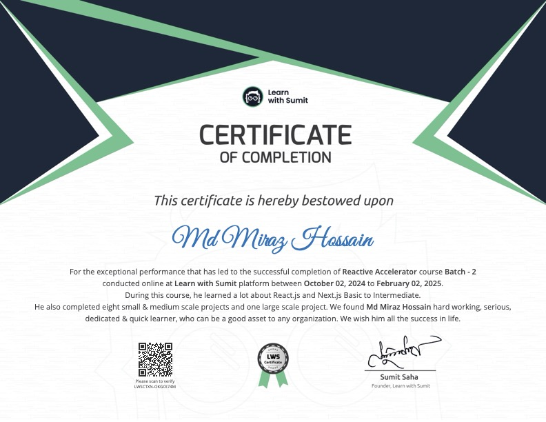
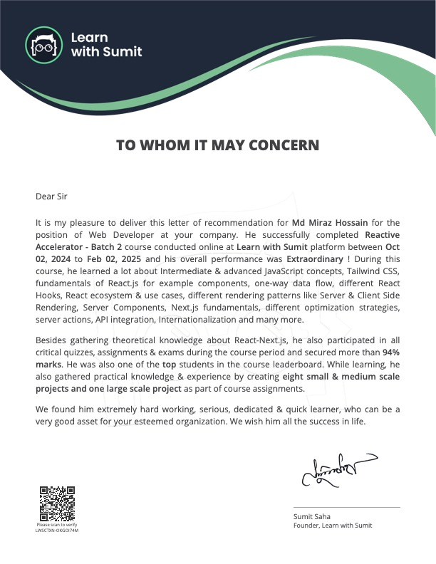
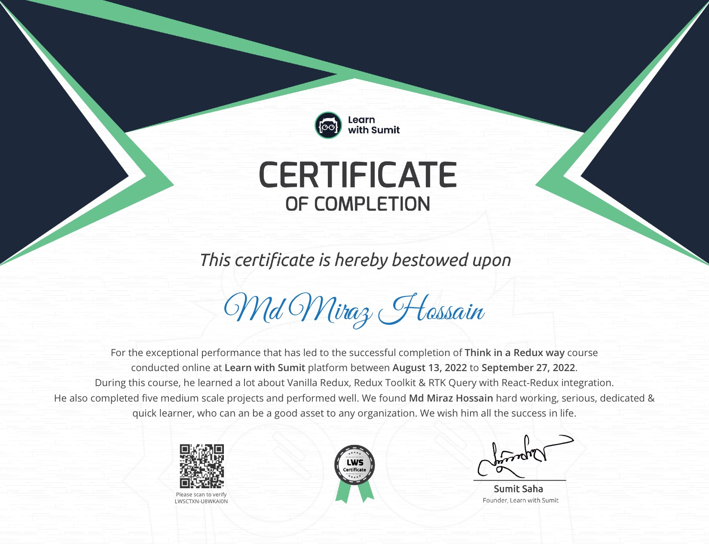
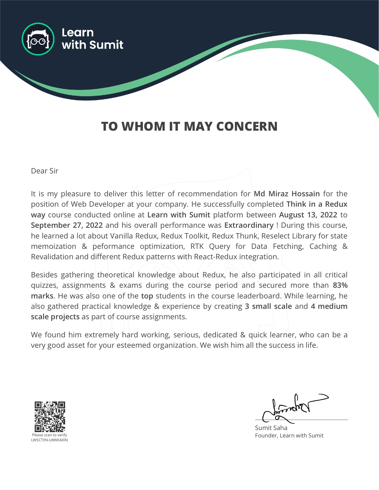
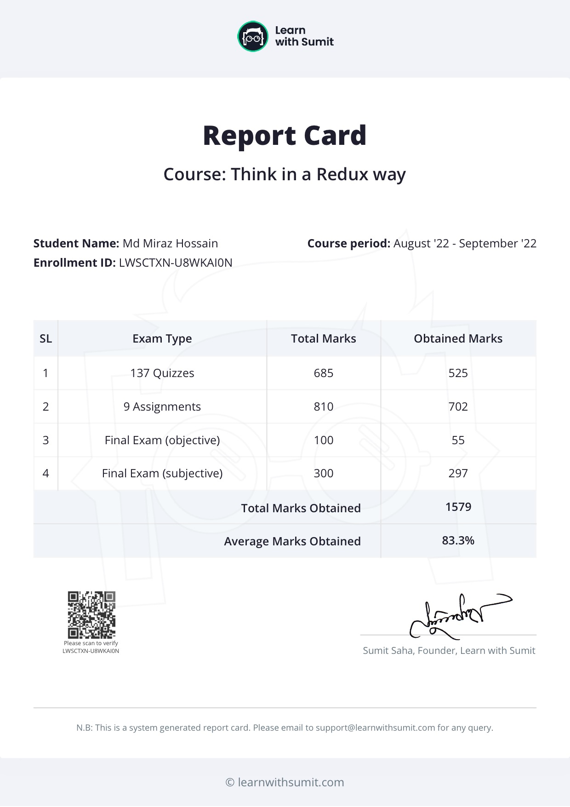

  

 

  
  
  
  
  

## 🔥 Tech Stack

**Shipping with**

**Exploring**

---

## 📊 GitHub Stats

  

  

---

## 🏅 Certificates

### 🐍 HackerRank — Python (Basic)

  
    
  

---

### ⚛️ LWS — Reactive Accelerator (Next.js + React)

  
  &nbsp;
  
  &nbsp;
  
    
  

---

### 🔄 LWS — Think In A Redux Way

  
  &nbsp;
  
  &nbsp;
  
    
  

---

  
  

   

  > *If you're here — drop a ⭐ and hit follow. It means a lot!*

