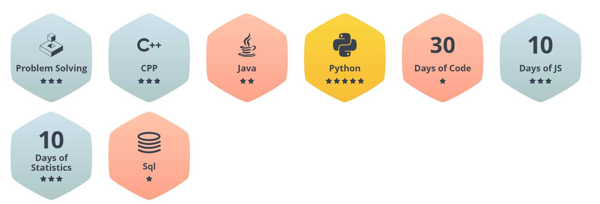

<h1 align="center">
    Hello there, I'm Miraz  
</h1>

    

<h4 align="center">
    I am a Python programmer with 5 years of experience in software engineering. I specialize in developing user-friendly applications and web services using Python. I also have a good understanding of object-oriented programming and functional programming. I am experienced in using frameworks such as Django, as well as libraries such as NumPy, Pandas, and SciPy. Additionally, I have developed machine learning projects using TensorFlow and Keras.and I am looking to expand my knowledge and experience in the field of Python programming.
    
     If you're here please give me stars ⭐ And don't forget to follow
    
</h4>

### Connect with me:

<!-- 

 -->

### My languages:

    
    
    
    

### My profile at HackerRank: https://www.hackerrank.com/mz_miraz

  

### Verify LWS Certificate: https://learnwithsumit.com/certificates/verify/LWSCTXN-U8WKAI0N

  

